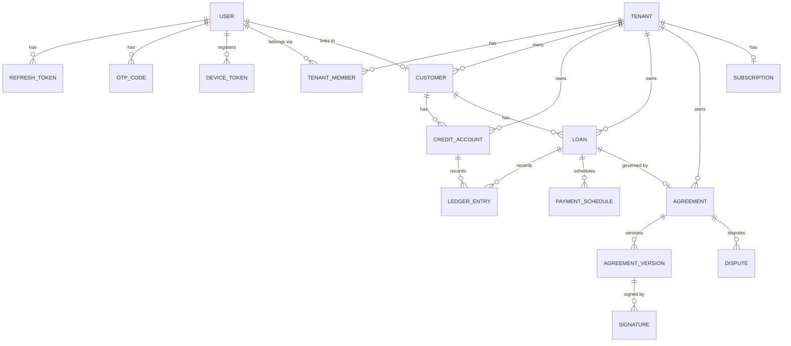

# Trust Me – ER Diagram (Phase 1)

```mermaid
erDiagram
  USER ||--o{ REFRESH_TOKEN : has
  USER ||--o{ OTP_CODE : has
  USER ||--o{ DEVICE_TOKEN : registers
  USER ||--o{ TENANT_MEMBER : "belongs via"
  TENANT ||--o{ TENANT_MEMBER : has
  TENANT ||--o{ CUSTOMER : owns
  TENANT ||--o{ CREDIT_ACCOUNT : owns
  TENANT ||--o{ LOAN : owns
  TENANT ||--o{ AGREEMENT : owns
  TENANT ||--o| SUBSCRIPTION : has
  USER ||--o| CUSTOMER : "links to"
  CUSTOMER ||--o{ CREDIT_ACCOUNT : has
  CUSTOMER ||--o{ LOAN : has
  CREDIT_ACCOUNT ||--o{ LEDGER_ENTRY : records
  LOAN ||--o{ LEDGER_ENTRY : records
  LOAN ||--o{ PAYMENT_SCHEDULE : schedules
  LOAN ||--o| AGREEMENT : "governed by"
  AGREEMENT ||--o{ AGREEMENT_VERSION : versions
  AGREEMENT_VERSION ||--o{ SIGNATURE : "signed by"
  AGREEMENT ||--o{ DISPUTE : disputes
```
